# The shape of it

Nine areas of the system, drawn. `docs/infrastructure.md` says what each piece
is for and when to reach for it, `DESIGN.md` says why it was chosen, and
`deploy/README.md` says how to operate it. This is the one that says where
things sit and what touches what.

Everything here depicts code that runs today, with one exception: most of the v1
pipeline is unbuilt, and the parts that do not exist yet are drawn with a dashed
border and labelled `«not built»`. `PLAN.md` owns the roadmap — this file only
draws it so the tables and packages below have somewhere to land.

---

## What runs, and what talks to what

Nine containers in one compose project, sharing a VPS with four other stacks.
Four facts do most of the work in this picture:

- **Nothing publishes a host port in production.** Caddy reaches the services
  over the compose network and the tunnel reaches Caddy, so there is no port to
  collide with the neighbouring stacks and the database has no public surface.
- **`cloudflared` dials outward.** The Cloudflare edge never dials in. That is
  the whole ingress story, and it is why there is no firewall rule to maintain.
- **`api`, `bot` and `reddit` are the same image** with different commands. One
  dependency set, one build; the cost is that the api image carries `discord.py`
  without importing it.
- **`transcribe` and `skybird` are not**, and that is the rule the pair above is
  the exception to. A separate image is what a separate dependency set earns:
  ctranslate2, onnxruntime and PyAV for one, ffmpeg and yt-dlp for the other,
  and neither the status service nor the bot has any use for either.

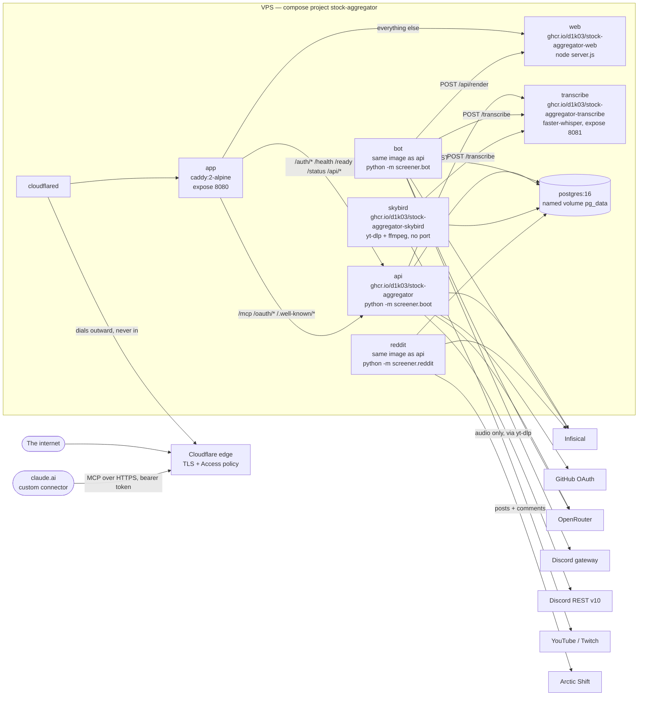

Two edges are the ones people get wrong.

**`/api/*` belongs to the Python service, not to Next.js.** Caddy routes it to
`api:8080` ahead of the catch-all, so the dashboard's `/api/ask`, `/api/handoff`
and `/api/audit` are all answered by `screener.health`. Next.js owns exactly one
route of its own, `/api/render`, and Caddy never sends anything there — it is
unreachable from the internet by construction rather than by a check. **Do not**
add a Next.js API route expecting it to be routable.

**`bot → web` is a real dependency.** The bot posts a chart's SVG to
`web:3000/api/render` and gets a PNG back, because `web/lib/chart-svg.ts` is the
only place a chart is drawn and the Discord image must not drift from the one on
the dashboard.

`web` itself is static and unwired: its only environment variable is `NODE_ENV`,
it holds no credentials, and it never opens a database connection. `bot` has no
port, no Caddy route and no healthcheck — discord.py reconnects with its own
backoff, and a check that cannot tell "reconnecting" from "wedged" would restart
a bot that was about to recover.

**`skybird` has no port either, and no edge pointing at it.** It is the only
service nothing calls: it reads what to do from Postgres, pulls audio, posts it
to the transcriber and writes lines back. That is what "the database is the
control plane" means in this picture — the arrow from the dashboard to a running
capture goes through `pg`, not across the network. It has no healthcheck for the
same reason the bot has none, and it holds a Postgres advisory lock so a second
copy stands by rather than capturing the same stream twice.

**`api` answers claude.ai as well as the browser.** The connector is not a
container of its own, and could not be: its OAuth consent screen needs the
session cookie the status service issues, so the two share a process. That
process therefore holds three read-only database passwords and picks the role
per call, which is the one place in this system where the separation between
roles is a branch rather than a credential. `docs/infrastructure.md` says so
where it describes the connector.

Its three paths need `handle` blocks of their own because none of them can live
under `/api/*`: `/.well-known/*` is fixed by RFC 9728 and RFC 8414, and `/mcp`
is what somebody types into Claude. Without them the catch-all sends all three
to Next.js, which redirects, and an `Authorization` header does not survive a
redirect.

**`transcribe` has no Caddy route on purpose.** `/transcribe` matches the
catch-all, which goes to Next.js, so nothing on the internet resolves to it. The
browser reaches it through `api`, which is what holds the session.

---

## Fetching, and where Bright Data sits

`screener.fetch` is one function over an ordered list of strategies, first
success wins. **The order is whatever the caller passes** — there is no fixed
chain, and the only default is `DEFAULT_STRATEGIES = ("direct",)` in
`fetch/chain.py`, with a test enforcing it. Every proxy path has to be asked for
by name, so depending on Bright Data is a visible decision in a diff rather than
something a default turned on quietly.

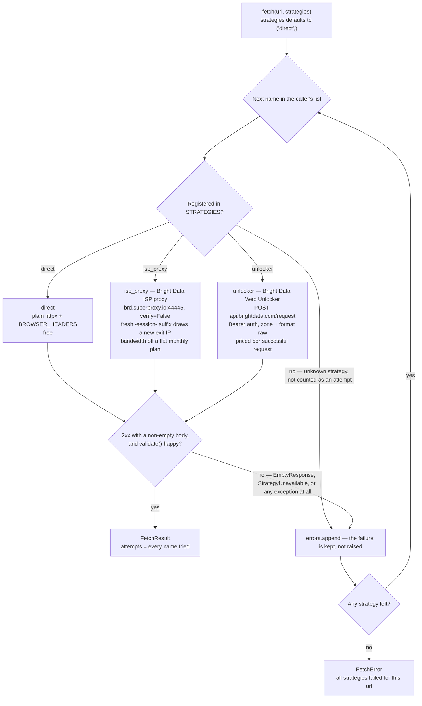

Three behaviours the diagram encodes and prose would bury:

- **A 2xx with an empty body is a failure** and demotes to the next strategy,
  unless the caller passes `allow_empty=True`. More than one provider answers a
  rate-limited request that way, and the fact layer is append-only, so an empty
  payload written once is there for good.
- **An unconfigured strategy raises `StrategyUnavailable` from inside itself**
  rather than being silently skipped, so "no Bright Data credentials set" lands
  in the error list beside genuine failures instead of vanishing.
- **There is no retry and no backoff. The chain is the retry.** `except
  Exception` in the loop is deliberately broad — the next strategy is the
  handler.

`unlocker` is registered and reachable but has no production caller today, and
**do not** put it first in a chain: it is the only strategy with a per-call
price. `universe/sources/yahoo.py` is the one module that deliberately bypasses
`fetch()` altogether, because a Yahoo crumb is only valid alongside the cookie
issued with it and `fetch()` builds a fresh client per call, which would discard
the jar.

---

## The packages

Each piece is its own package with a small public surface through `__init__.py`,
and nothing outside imports a submodule directly. Solid edges are eager imports;
**dashed edges are deferred imports inside a function**, which is the mechanism
that keeps `discord.py` out of the status service's import graph.

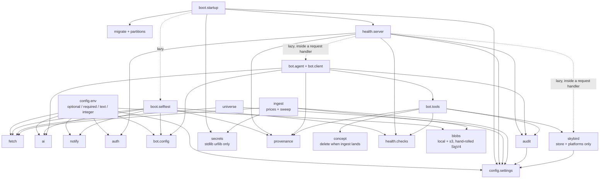

Two asymmetries are worth reading off it.

**`screener.notify` has exactly one consumer**, `boot/selftest.py`, and even
that only reads its configuration. Nothing sends an alert, because the alerting
code is not written yet — the package is a delivery mechanism waiting for
something to deliver.

**`bot` and `health` depend on each other**, but on different leaves and in
different ways. `health.server` reaches `bot.agent`, `bot.handoff` and
`bot.budget` only from inside request handlers; `bot/tools/deployment.py`
imports `health.checks` eagerly. Neither direction pulls the other's heavy
dependency.

---

## The database

Roughly twenty tables across three schemas. `public` holds the screener's own
data model; `auth` and `audit` are separate because no scoring query joins to
them, and because the test suite's `drop schema public cascade` should keep
meaning exactly what it says. The design and its reasoning are in
`docs/specs/2026-09-04-database-schema-design.md`.

### Reference and identity

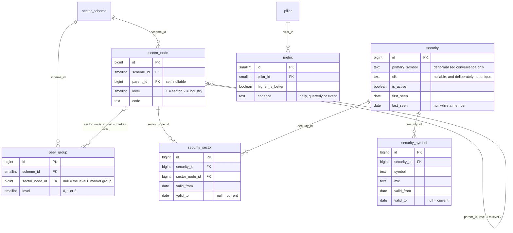

Both temporal tables carry **two overlapping guarantees, and they are not the
same guarantee**. A partial unique index on `where valid_to is null` gives "at
most one *current* row". A GiST exclusion constraint over `daterange(valid_from,
valid_to, '[)')` gives "no two validity periods overlap" — which a partial index
cannot express at all. Closing at `valid_to = as_of` and opening at `valid_from
= as_of` on the same day do not overlap, because the range is half-open.

**`security` and `peer_group` are not linked directly.** The join runs `security
→ security_sector → sector_node → peer_group`, and the group actually used on a
given day is recorded per ticker on `metric_daily.peer_group_id` — so a score
can be traced to the peers it was measured against, even after a
reclassification moves the ticker somewhere else.

### Ingest and the bitemporal fact layer

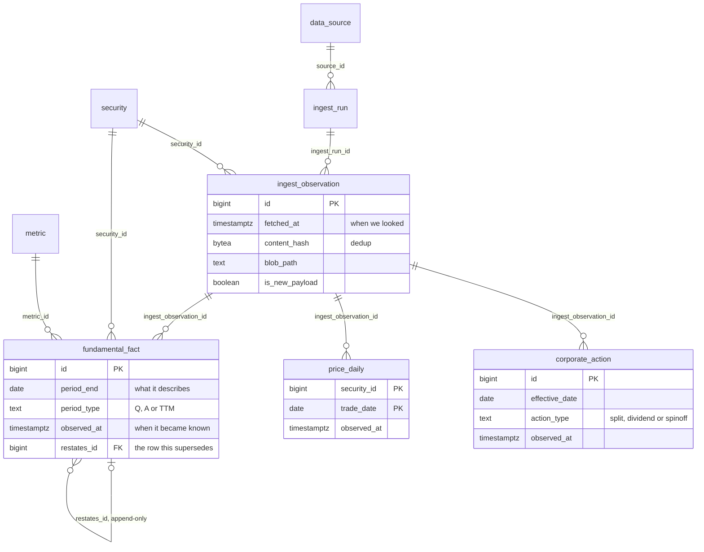

There is **no column named `known_at`, `valid_time` or `system_time`** anywhere.
The two axes are named: what a fact describes is `period_end` / `trade_date` /
`effective_date`, and when it became known is `observed_at` — `fetched_at` on
`ingest_observation`. A restatement **inserts a new row pointing at the old
one** through `restates_id`; nothing is ever overwritten.

`ingest_observation` is deliberately not partitioned. A partitioned table's
unique constraint must include the partition key, which would force a composite
primary key and break the simple foreign keys the traceability chain depends on.

### Scoring runs, the derived daily layer and alerting

```mermaid
erDiagram
    scoring_logic_version ||--o{ scoring_run : logic_version_id
    weight_version ||--o{ scoring_run : weight_version_id
    weight_version ||--o{ pillar_weight : weight_version_id
    pillar ||--o{ pillar_weight : pillar_id
    scoring_run |o--o{ scoring_run : supersedes_run_id
    scoring_run ||--o{ metric_daily : scoring_run_id
    scoring_run ||--o{ pillar_score_daily : scoring_run_id
    scoring_run ||--o{ snapshot_daily : scoring_run_id
    scoring_run ||--o{ event_flag_daily : scoring_run_id
    scoring_run ||--o{ peer_group_stat : scoring_run_id
    scoring_run ||--o{ alert_event : scoring_run_id
    peer_group ||--o{ metric_daily : peer_group_id
    fundamental_fact |o--o{ metric_daily : "fundamental_fact_id, null for price metrics"
    alert_rule ||--o{ alert_event : alert_rule_id
    alert_rule ||--o{ alert_state : alert_rule_id
    security ||--o{ alert_event : security_id
    security ||--o{ alert_state : security_id

    scoring_run {
        bigint id PK
        daterange as_of_range "one live run per date, by exclusion constraint"
        interval cutoff_offset "visible facts are observed_at <= D + offset"
        boolean emits_alerts "false means skip alerting entirely"
        text status "live, backfill or experiment"
        text git_sha "reproducibility, never comparability"
        bytea config_hash "the scoring parameters, not the process config"
    }
    metric_daily {
        date as_of PK
        numeric percentile "0 to 100, within the peer group"
        int peer_count
        smallint fallback_level "2 industry, 1 sector, 0 market"
    }
    pillar_score_daily {
        date as_of PK
        numeric score
        smallint metric_count
        numeric coverage "0 to 1"
    }
    snapshot_daily {
        date as_of PK
        numeric blended_score "derivable, not ground truth"
        smallint pillar_agreement
        numeric min_coverage "worst pillar coverage that day"
        smallint worst_fallback_level
    }
    alert_rule {
        bigint id PK
        text condition_type
        smallint cooldown_days
        numeric min_coverage "the data-quality gate, per rule"
    }
    alert_event {
        bigint id PK
        date as_of "unique with rule and security — idempotency"
        numeric previous_blended_score
        text driver
        text delivery_status "pending, sent or failed"
    }
    alert_state {
        bigint alert_rule_id PK
        bigint security_id PK
        date cooldown_until
        smallint last_direction "-1 or 1"
    }
```

**No arrow points *into* a partitioned table, and none may.** Nothing in the
schema holds a foreign key to `price_daily`, `metric_daily`,
`pillar_score_daily`, `snapshot_daily` or `event_flag_daily` — that constraint
is what keeps a year's partition detachable.

`snapshot_daily` has **no `weight_version_id`** on purpose: the run carries it,
and the blended score is derivable from pillar scores plus that stamp.
`alert_state` tracks `last_direction` because a cooldown that suppresses the
*opposite* crossing is wrong — a score crossing up and then genuinely collapsing
back is exactly the event worth hearing about. And there is deliberately **no
`crossing` table**; crossings are derived from consecutive comparable
`snapshot_daily` rows.

### Sessions, the audit trail, and the migration ledger

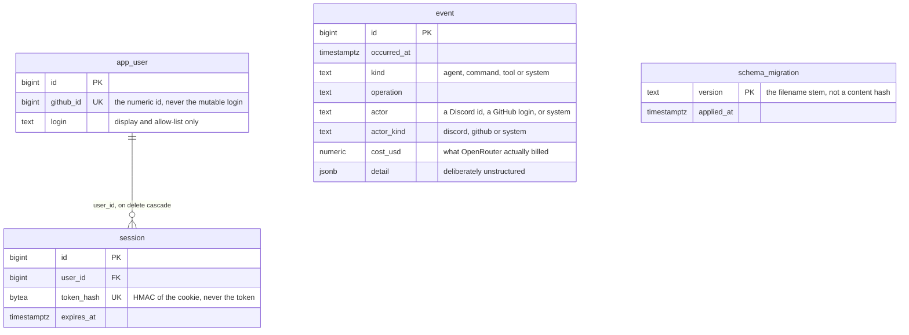

`auth.app_user → auth.session` carries the **only `on delete cascade` in the
whole schema**. `audit.event` has **no foreign keys at all**: `actor` is free
text because Discord ids and GitHub logins do not share a type, and joining them
to one table would invent a relationship that does not exist.

`public.schema_migration` is created by `src/screener/migrate.py`, not by any
migration file. It keys on the filename stem rather than a content hash, so
**renaming a shipped migration re-runs it**.

### Live stream capture

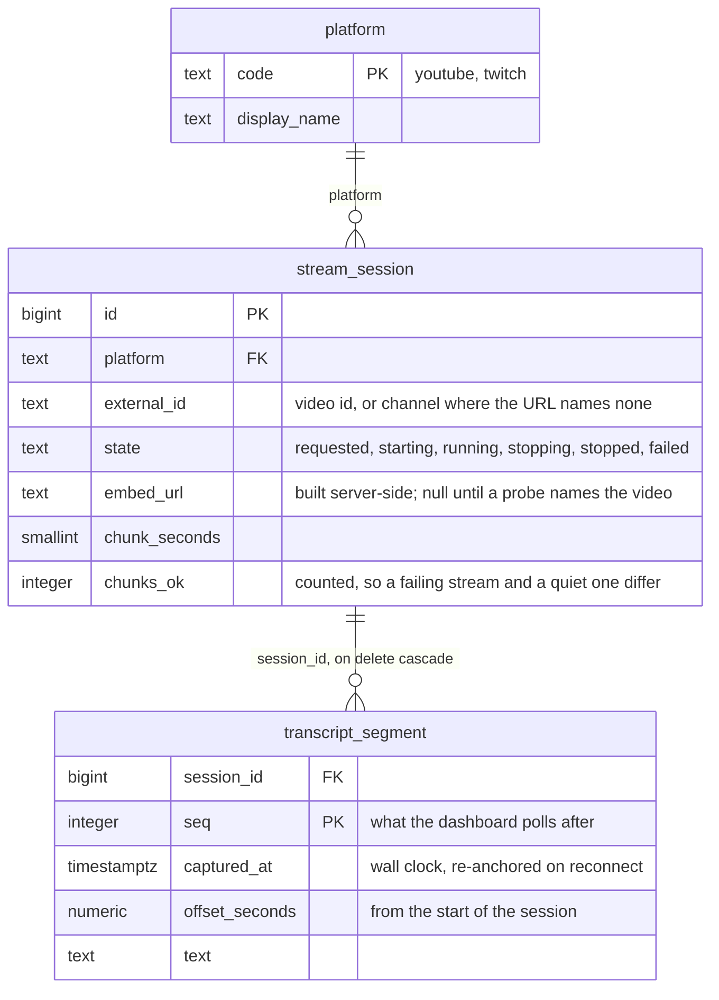

Three things here go against the grain of the rest of the schema, each on
purpose.

**`platform` is a table rather than `text` + `check`.** The schema conventions
say enumerations are check constraints, and `state` follows that — it is a
closed set this code owns. The platform list is the opposite: the whole point is
that it grows, and a growing list behind a check constraint is a migration every
time somebody writes an adapter.

**`transcript_segment` is not partitioned**, unlike every other table that grows
by the day. Retention here is "delete the session", which cascades, rather than
a date-range drop; and the only read that matters is one session in sequence
order, which partitioning by time would scatter across partitions instead of
keeping adjacent.

**`stream_session` is a queue as well as a record.** A partial unique index on
`(platform, external_id)` over the four live states is what stops one stream
being captured twice, and a partial index on `state` is what makes the
supervisor's two-second poll cheap. Nothing else in this schema is read by a
process asking what to do next.

### Partitions

Five parents, all range-partitioned, all yearly, and no default partition
anywhere — attaching a new partition alongside a default requires a full scan.

| Parent | Key | First year |
|---|---|---|
| `price_daily` | `trade_date` | 2020 |
| `metric_daily` | `as_of` | 2026 |
| `pillar_score_daily` | `as_of` | 2026 |
| `snapshot_daily` | `as_of` | 2026 |
| `event_flag_daily` | `as_of` | 2026 |

The asymmetry is deliberate: momentum needs twelve months of trailing prices, so
a 2026 ingest writes 2025 rows, while a derived row cannot predate the run that
produced it. `ensure_partitions` decides existence by **partition-bound coverage
rather than by name**, reading `pg_get_expr(relpartbound)` and testing for
overlap — which is what will let monthly partitions be introduced at a future
year boundary without colliding with a same-named yearly one.

---

## The v1 pipeline

The spine, and the only diagram here that draws things which do not exist.
Universe, identity and daily **price** ingest are built; fundamentals ingest is
cycle two, and scoring, the snapshot diff and alerting are all unwritten.

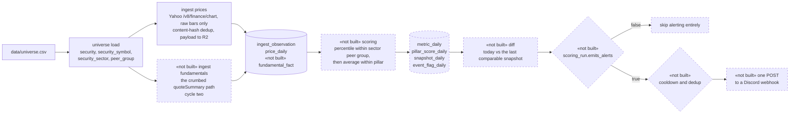

The `emits_alerts` gate is drawn because it is the invariant most likely to be
forgotten. Postgres cannot express it as a cross-table check, so **the alerting
code owns it**: a run with `emits_alerts = false` must be skipped before the
alerting step, not attempted and left to collide. The unique constraint on
`(alert_rule_id, security_id, as_of)` would catch a backfill, but it is a
backstop, not the mechanism — without the skip, a backfill run eventually fires
history into the channel.

Alerts fire on the **crossing**, not the state, and carry their reasoning: the
score delta, the pillar scores, the driver and any event-risk flags. They say
"score crossed threshold", never "STRONG BUY".

---

## From push to production

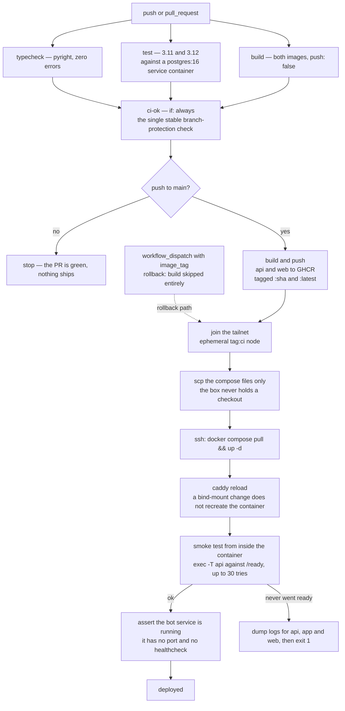

Three of these steps exist because something went wrong once.

**The explicit `caddy reload`** is there because changing a bind-mounted file
does not recreate the container. Without it a Caddyfile change ships but never
takes effect — that is how `/api/*` kept going to Next.js for a whole release.

**The smoke test runs inside the container**, never through the tunnel, because
Cloudflare Access answers an unauthenticated request with a 302 and `curl -f`
treats a redirect as success. A smoke test that passes on a redirect is worse
than no smoke test.

**The bot is checked separately**, by asserting the service is still running
fifteen seconds later, because it has no port to probe and no healthcheck to
read.

Rollback is the same workflow dispatched by hand with `image_tag` set to an
older SHA; the build job is skipped and the box repoints. **Do not** roll back
across a migration boundary — migrations are applied forward at startup and
nothing undoes them.

---

## Starting up

`python -m screener.boot` takes `serve`, `migrate` or `selftest`, and does the
same first two things in every case.

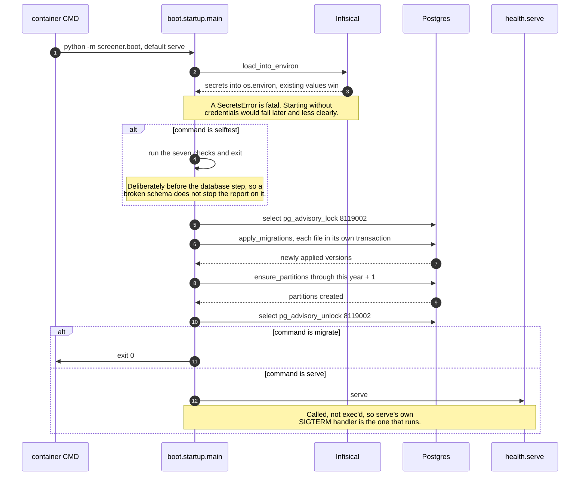

The advisory lock exists because `apply_migrations` reads the applied set and
then runs DDL with nothing in between. Two containers starting at once — a
rolling deploy, or a restart racing a manual `compose up` — would both see
version N unapplied, both run its `create table`, and the loser would die on
`DuplicateTable`, which reads as a broken migration rather than as a race. The
lock is session-scoped, so a container killed mid-migration releases it when its
socket closes.

`selftest` is the only thing that exercises the infrastructure end to end today,
which is why it is worth running after a deploy. It checks the database, the
build SHA, a direct fetch, a proxied fetch, OpenRouter, the Discord webhook's
configuration and the bot's token. Two of those are pointed:

- **The `isp_proxy` check fails when the proxied exit IP matches the direct
  one.** A proxy that is configured, billed and doing nothing should not report
  OK.
- **The Discord check never sends.** It confirms the webhook is configured and
  stops there — a self-test must not make an outward-facing post.

Unconfigured is `SKIP`, not `FAIL`, and every check is wrapped so one crash
cannot stop the rest.

---

## Steven

The Discord bot is a command surface, not a delivery channel, and it runs as its
own process for the same reason it has its own container: a gateway connection
is a long-lived thing that should not share a lifecycle with a web server.

```mermaid
sequenceDiagram
    autonumber
    participant D as Discord
    participant CL as bot.client
    participant A as bot.agent
    participant BG as bot.budget
    participant DB as audit.event
    participant M as OpenRouter
    participant T as bot.tools
    participant W as web /api/render

    D->>CL: mention in a guild, or anything in a DM
    CL->>CL: wants_reply — say it in a channel,<br/>no need to in a DM
    opt DM
        CL->>DB: last_handoff_context, 30-minute window
    end
    CL->>A: asyncio.to_thread respond
    Note over CL,A: Every layer below is synchronous. Blocking the<br/>loop stalls the heartbeat, not just one command.
    A->>BG: check, before the model is called
    alt over the daily cap
        BG-->>A: refused
        A-->>D: names the figures, records outcome refused
    else allowed, or Postgres unreachable
        Note over BG: Fails open. Refusing everyone because<br/>Postgres blinked is the worse failure.
        opt not a fresh conversation
            A->>DB: recent_turns, for this person's folded identities
            DB-->>A: the last two exchanges, oldest first
        end
        A->>M: converse, up to six tool rounds
        M-->>A: tool call: chart
        A->>T: dispatch, inside collecting
        T-->>A: one sentence back to the model
        Note over T,A: The 60-point series never enters the message<br/>list. The chart rides beside the reply.
        A->>M: tool result
        M-->>A: final text
        A->>W: POST the SVG spec, up to three charts
        W-->>A: PNG
        A-->>D: reply plus attachments
    end
    A->>DB: record — tokens, cost, outcome, and<br/>the turn itself, truncated
```

`collecting()` is a `ContextVar` rather than a module global because each
request runs on its own worker thread and `asyncio.to_thread` copies the
context, so two people asking at once cannot be handed each other's charts. The
model names *what* to mark — `peak`, `low`, `surge`, `drop`, `crossing`,
`latest` — and the index is computed from the data. A model supplying
coordinates would be inventing where the marker goes, which is the same failure
as inventing a number and worse for being drawn precisely.

Steven remembers the last two exchanges, and reads them back from the audit
trail rather than holding them in a variable, because the bot and the status
service are separate processes and a variable in one is invisible to the other.
Identities are folded exactly as the spend cap folds them, so a thread started
on the dashboard is the one that carries on in a DM rather than a second
stranger. The memory is bounded on every axis at once — two exchanges, 300
characters each, final text only, half an hour, and nothing at all when the
dashboard sends `fresh=1` for a new chat — because a remembered turn is re-sent
on every round of every message after it, so the cost of remembering is
multiplied rather than paid once.

The handoff from the dashboard crosses the same gap and uses the same channel:
two processes that share no memory, and a trail that both can read.

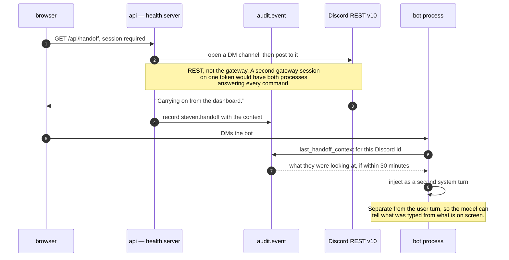

The daily spend cap is per person and checked before the model call. It folds
Discord onto GitHub through `DISCORD_USER_MAP` **in both directions**, so it
cannot be doubled by asking on the other surface, and `0` means nobody may spend
anything — the permissive reading of zero is explicitly rejected.

---

## The universe

Two commands that share nothing but a file. `refresh` is network-only and never
opens a database connection; `load` is database-only and never opens a socket.

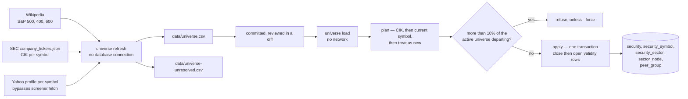

**The committed CSV is the review surface.** A sector reclassification moves a
ticker between peer groups, and a peer group change moves a score — so it has to
show up in a diff before it can move anything. That only works because the
file's ordering is deterministic and its field order never drifts.

**Identity is matched on CIK first, then on the current symbol, then treated as
new.** A symbol is a mutable attribute: matching on it turns a rename into a
departure plus an unrelated arrival, orphaning the company's history. Two rows
resolving to one security raises rather than merging.

The departure ceiling check sits **inside** the transaction, not before it. On
an autocommit connection, the taxonomy written outside it would survive a
refusal — so the guard would leave behind exactly the half-applied state it
exists to prevent.
