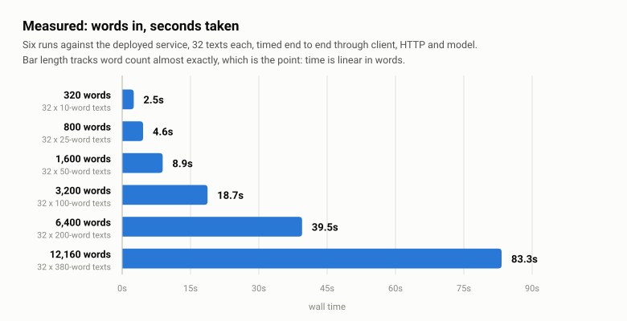
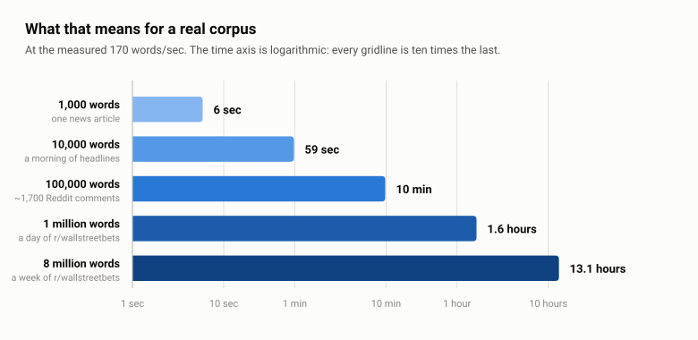

# The toolbox

What exists, when to reach for it, and when not to.

`DESIGN.md` says why each of these was chosen and `deploy/README.md` says how to
operate them. This is the middle document: you are about to write some code and
want to know which of these it should use.

The recurring theme is that most of these cost nothing until used and quite a
lot once used carelessly, so nearly every entry has a "reach for it when" and a
"do not" that matters more.

---

## Fetching over HTTP

`screener.fetch` — one function, an ordered list of strategies, first success
wins.

```python
from screener.fetch import fetch

result = fetch(url)                              # direct only
result = fetch(url, ("direct", "isp_proxy"))     # fall back if direct fails
```

| Strategy | Cost | Reach for it when |
|---|---|---|
| `direct` | free | Always. This is the default and should stay the default. |
| `isp_proxy` | bandwidth off a flat monthly plan | A source blocks the VPS, or rate-limits by IP and you need a different one. |
| `unlocker` | **per successful request** | A source defeats the proxy too. Last resort, and never first in a chain. |

**The default is `("direct",)` and a test enforces it.** Bright Data is
reachable only when a caller names it, so adding a proxy to a request is a
visible decision in a diff rather than something a default did quietly.

Two behaviours worth knowing before you write a source:

- **A 2xx with an empty body is treated as a failure** and escalates to the next
  strategy. More than one provider answers a rate-limited request that way, and
  it is indistinguishable from "nothing to report". Pass `allow_empty=True` if
  a source genuinely returns nothing sometimes.
- **There is no retry inside a strategy.** The chain is the retry. Re-issuing
  down the path that just failed rarely helps, and the next scheduled run picks
  up anything transient.

`FetchResult.strategy` records which path served the request and
`.attempts` records what was tried first — worth logging, because a run that
quietly fell back to a proxy is a fact about the source.

### When one session has to outlive the request

`fetch()` builds a client per call, so anything whose authorisation lives in a
cookie cannot use it: the jar is gone before the next request needs it. That is
what `LanePool` is for.

```python
from screener.fetch import LanePool

with LanePool.from_env(headers=BROWSER, timeout=25.0) as pool:
    lane = pool.acquire()          # rotates on every call
    response = lane.get(url)       # never raises on status
```

A **lane** is one client, one cookie jar, one exit address, held for the length
of a run. A pool hands them out round-robin, so a long job leaves by every
address the zone holds instead of piling onto one. `park(seconds)` takes a lane
out of rotation after a 429 and `acquire()` skips it until it frees.

Two things it deliberately is not. It is **not a strategy** — it does not appear
in the table above and `fetch()` cannot reach it. And it is **not a rate
limiter**: the pool never sleeps and never retries, so the waiting and the
numbers stay with the caller, which is where D6 puts them.

`pool.across(items, work)` is the one place concurrency lives, and it runs
**one worker per lane and has no argument to run more**. The claim it rests on
is not "concurrency is fine" but the narrower "one request in flight per exit
address": four workers over four addresses is not four over one. Measured before
it was allowed — the whole S&P 500, 1,006 requests, 44s against 138s sequential,
every one a 200. `acquire()` is still the sequential path and still does not
change how many requests are in flight.

Yahoo is the only caller today, through `screener.universe.sources.yahoo`.

### Bright Data specifically

An ISP proxy zone with **four UK exit IPs**, on a flat monthly plan that a
sibling project already pays for. That is the whole reason it is available here:
the marginal cost of *having* it is zero.

There are two ways to reach them, and they are not interchangeable. `isp_proxy`
draws a **fresh random session per request**, which is right for a one-off
request that got blocked — but it is a draw, not a rotation: twelve draws
against the live zone came back 5/3/2/2 across the four addresses. `LanePool`
**pins** one lane per address with an `-ip-` flag, which is the only way to get
four addresses used evenly, and the only form that can hold a cookie. Set
`BRIGHTDATA_PROXY_IPS` to the addresses; leave it unset and there are no lanes.

The self-test checks both: that a proxied exit differs from the box's own, and
that the configured lanes differ **from each other** — four lanes quietly
sharing one address is billed, looks healthy, and spreads nothing.

**Do not** reach for it because a source is slow, or intermittently 500s, or
because you are not sure. Reach for it when you have seen a block — with one
exception, written down because it is an exception. Yahoo starts on the lanes
rather than falling back to them, since a night's ingest is ~3,000 requests off
a single VPS address and a pinned lane measured 1.07x direct latency, so
spreading them costs about twenty seconds. Clearing `BRIGHTDATA_PROXY_IPS` is
how that is switched off.

The Web Unlocker is a separate product billed per successful request and should
be treated as spending money every time it runs. It cannot be a lane: it POSTs
each URL as an independent call, so there is no jar to keep.

---

## Scraping a page

`screener.magpie` — a link in, an article out.

```python
from screener.magpie.client import scrape      # what api and bot import
result = scrape("https://example.com/a-piece", requested_by="ehewes")
```

**The ladder is the one above.** Magpie names `direct, isp_proxy, unlocker` and
`screener.fetch` does the escalating; what magpie adds is whether the site
permits it, what counts as a page rather than a block, what it cost, and where
it goes. It is the first and only caller in the project that names `unlocker`.

| It stops at | Because |
|---|---|
| robots.txt disallows | Escalating would turn respecting robots.txt into routing around it |
| the body is not a page | `FetchResult` has no Content-Type, so a PDF is mojibake and the ladder would pay to fail |
| the publisher says it is not free | "The same bytes a browser gets" does not stretch to getting past a subscription check |

Everything else escalates, including a 200 that is really a challenge page —
that is a `validate` callback rejecting the body, which is what turns a soft
block into a fallback rather than a stored interstitial.

**What it costs.** Only the last rung. `MAGPIE_UNLOCKER_DAILY_MAX` (default 20)
caps billed fetches a day, counted out of `magpie.attempt`. Deliberately not
`DAILY_SPEND_CAP_USD`: that is $0.10 against a reply costing $0.00005, so fifty
scrapes would empty it and Steven would stop answering. The spend is still on
`/audit`; the count is the gate. An unreadable meter drops the billed rung and
tries the free ones, so it fails closed without failing shut.

**Where it lands.** `magpie.document` is one row per canonical URL — tracking
parameters stripped, so one article shared from three places is one row — and
`magpie.attempt` is every try including the refusals, which is what stops the
same dead link being fetched again by whoever asks next. Both are readable in
`/playground`, by Steven, and by the claude.ai connector. The page as fetched is
gzipped into the blob store as evidence.

**The sites a document points at.** Opening one on `/magpie` reads its stored
page back for the links the article makes, which costs no request: the page is
already in the blob store, and this is the only thing in the project that reads
a payload back rather than only writing one. Taken from the extracted article
rather than the raw HTML, because every anchor on a page includes the site's own
navigation and footer. Read once and remembered, so a document nobody opens is
never read.

`magpie.link.scraped_id` is the frontier a crawler would drain. Nothing drains
it: every fetch is still one somebody clicked.

**Where it may go.** `screener.magpie.reachable` refuses loopback, private,
link-local, reserved and multicast addresses, and requires every address a name
resolves to be public. It runs as a hook on each request rather than a check on
the URL, because with redirects followed the address fetched is not the address
submitted: a public page can answer `302 Location: http://169.254.169.254/` and
nothing else would look. `screener.fetch` takes the hook; no other caller passes
one, because no other caller fetches an address somebody else chose.

**Do not** point it at a login, a paywall or anything needing a cookie. It holds
no credentials and is not meant to.

---

## The payload store

`screener.blobs` — two verbs against one bucket.

```python
from screener.blobs import blob_path, store

path = blob_path("yahoo", "chart", date.today(), security_id)
store().put(path, gzip.compress(payload))
```

`BLOB_BACKEND=local` is a directory and what the test suite uses. `BLOB_BACKEND=s3`
is Cloudflare R2, whose free tier covers this comfortably — prices are about
1 GB a year across roughly 45,000 writes a month.

SigV4 is hand-rolled in `blobs/sigv4.py` rather than pulled from `boto3`, which
would add five packages and a third HTTP stack for two verbs. That is tractable
only because the case is narrow: static credentials, one bucket, no session
tokens, no presigning, no multipart. It is verified against AWS's published
conformance vector.

**Nothing here prunes, expires or deletes.** `ingest_observation.blob_path` is
`not null` and every score has to trace back to a stored response, so a pruning
job would make that a promise the database cannot keep. This is evidence, not
cache.

**Do not** reach for the `s3` backend in tests. `local` is the default and keeps
the suite offline. R2 wants `auto` as its region, and clock skew on the box
presents as a 403 rather than as a clock problem.

---

## Speech to text

`screener.transcribe` — faster-whisper on CPU, in a container of its own,
reached over the compose network the way the chart renderer is.

```python
from screener.transcribe import transcribe

spoken = transcribe(audio_bytes)     # Transcript | None, never raises
```

A Discord voice message in a DM is transcribed and answered as though it had
been typed, with what was heard quoted above the reply. The dashboard's mic
button puts the transcript in the composer instead, so a misheard ticker is
corrected before a model call is paid for.

| | |
|---|---|
| Cost | CPU only. No per-minute billing, and no audio leaves the box. |
| Model | `base.en`, int8, baked into the image. `initial_prompt` biases it toward tickers. |
| Cap | two minutes, enforced by the callers before anything is downloaded |

**It is the first service here with a resource limit**, which contradicts the
absence of one everywhere else: two cores and a gigabyte. Everything else in
this stack is idle until asked a question, and this saturates a core for as long
as the clip is, on a box shared with four other compose projects. The limit and
`WHISPER_THREADS` have to agree, or ctranslate2 spawns one thread per core it can
see and spends its time being descheduled inside the quota.

**Do not** reach for a bigger model first when it mishears a ticker. The
`initial_prompt` in `transcribe/server.py` is free and `small.en` costs roughly
three times the CPU.

**The audio is never written anywhere**, on disk or otherwise: it is held for one
request and dropped, and the transcription's own audit row records how long the
clip was rather than what was in it. The question does reach the trail on the
reply row, exactly as a typed question does, because that is where Steven's
memory lives, and a spoken question is a question. The `voice` flag on that row
is what tells a transcription error from a typo when reading it back.

---

## Sentiment

`screener.sentiment` — **FinBERT** (`ProsusAI/finbert`, 110M parameters)
exported to ONNX and run under `onnxruntime` on CPU, in a container of its own,
reached over the compose network the way the transcriber is.

```python
from screener.sentiment import score

readings = score(["Revenue beat expectations and margins expanded."])
# (Sentiment(positive=0.94, negative=0.02, neutral=0.04),)  -- or None
```

**What it is for.** The Sentiment pillar is one of the five the scoring model
is built around, and it is the only one with no input: Valuation and Quality
read stored line items, Momentum reads bars, and Sentiment reads text that
nothing in this system could turn into a number. This is the thing that turns
it into a number. `DESIGN.md`'s standing rule — *an LLM never emits a score* —
only holds if there is a classifier to hold it up, and this is that classifier.
`screener.ai` does narrative extraction and answers questions; it does not do
this, and this does not do that.

**What it does not do, and this is the part to read before building on it.** It
scores text. It does not know where the text came from, does not open a database
connection, does not connect anything to a security, and does not feed a pillar.
Two corpora are already ingested and waiting — `social_item` from
`screener.reddit` and `magpie.document` from `screener.magpie`, both readable
through the playground — and **joining them to this is unbuilt on purpose**.
`PLAN.md` holds that work and the four decisions it needs; the short version is
that deciding which security a comment is about is a harder problem than reading
its tone, and a new input moves a pillar for every ticker on the night it lands.

| | |
|---|---|
| Cost | CPU only. No key, no per-call price, and no text leaves the box. |
| Model | `ProsusAI/finbert`, pinned to revision `4556d130`, fp32 ONNX baked into the image |
| Cap | 32 texts a call, 4,000 characters each, enforced by the client before a request is made |
| Switch | none. There is nothing to configure, so `boot selftest` reports OK or FAIL and never SKIP |

**Three probabilities come back, not one number.** `Sentiment.score` is
`positive - negative` and is derived in the client, so a stored reading always
carries the inputs behind it. "Confidently neutral" and "torn between positive
and negative" both score near zero and are not the same reading — only the
distribution tells them apart, which is the same argument that keeps raw metrics
beside their percentiles in the scoring layer.

**The output columns are the thing that can go silently wrong.** FinBERT's
`id2label` is `['positive', 'negative', 'neutral']` — not alphabetical, and not
the order anyone guesses. Read in the wrong order every bullish headline scores
bearish, confidently, with nothing to notice. So the order is written beside the
weights as `labels.json` at export time, the service refuses to start if it
cannot read it, `/health` reports it, the deploy smoke test asserts it, and the
self-test scores a beat and a guidance cut and insists they land on opposite
sides. Five checks for one fact, because it is the only failure here that
produces a plausible number instead of an error.

**The conversion happens once, at image build time, in a stage that is thrown
away.** `deploy/finbert_export.py` installs torch to convert the checkpoint and
then runs the exported graph beside the original over a corpus with the shapes
this system really sees — a one-line headline, a padded batch, a comment past
the 512-token window, cashtags and accents — and fails the build if they
disagree by more than 2e-4. Measured on the box: **2.68e-06**. That check is
only possible where torch is installed, and the service it produces can never
run it.

**Measured on the VPS, which is the number that matters.** The box is a 4-vCPU
QEMU guest with **AVX but no AVX2 and no AVX512**, which is well below the
"modern desktop CPU" DESIGN.md estimated 20–50 texts/sec on:

**Throughput tracks words, not texts**, which is the only figure worth quoting:
a headline and a long comment differ by more than ten times per text and barely
at all per word. Every point below is a timed run against the deployed service,
32 texts of a fixed length, measured end to end through client, HTTP and model.

<picture>
  <source media="(prefers-color-scheme: dark)" srcset="img/sentiment-measured-dark.svg">
  
</picture>

| words in | texts | wall time | texts/sec | words/sec |
|---|---|---|---|---|
| 320 | 32 x 10 words | 2.55s | 12.5 | 125 |
| 800 | 32 x 25 words | 4.58s | 7.0 | 175 |
| 1,600 | 32 x 50 words | 8.90s | 3.6 | 180 |
| 3,200 | 32 x 100 words | 18.74s | 1.7 | 171 |
| 6,400 | 32 x 200 words | 39.49s | 0.8 | 162 |
| 12,160 | 32 x 380 words | 83.30s | 0.4 | 146 |

So **roughly 150 to 180 words a second**, and flat enough that any corpus divides
by one number. The short end is lower only because per-text overhead stops being
negligible once a text is ten words long. 380 words is the practical ceiling per
text: that is what fits in FinBERT's 512 word pieces, and anything longer is
truncated rather than split.

<picture>
  <source media="(prefers-color-scheme: dark)" srcset="img/sentiment-corpus-dark.svg">
  
</picture>

| corpus | roughly | time |
|---|---|---|
| 1,000 words | one news article | 6 sec |
| 10,000 words | a morning of headlines | 59 sec |
| 100,000 words | ~1,700 Reddit comments | 10 min |
| 1 million words | a day of r/wallstreetbets | 1.6 hours |
| 8 million words | a week of r/wallstreetbets | 13.1 hours |

**The last row is the one that constrains the design.** `screener.reddit` stores
roughly 132,000 r/wallstreetbets comments a week, and scoring all of them is over
half a day of CPU on a box shared with five other stacks. Whatever consumes this
samples, or reads posts and top comments only.

Model load is 2.1s, the graph is 438 MB on disk, and a worst-case request peaks
at 1,236 MB resident against the container's 2 GB. Four threads instead of two
buys 1.4x, not 2x, which is why the container is capped at two cores rather than
given all four.

**int8 was measured and rejected, and the numbers are not close.** Dynamic
quantization is the obvious way to shrink a 438 MB graph to 110 MB, and on this
CPU it is worse on both axes at once:

| | fp32 | int8 |
|---|---|---|
| Deviation from the checkpoint | 2.7e-06 | **0.373** |
| Headlines, 2 threads | 10.7/s | 9.8/s |
| Headlines, 4 threads | 15.2/s | 6.5/s |

A 0.37 shift in a probability is enough to move a text from positive to neutral,
so it is not a rounding cost — it is a different classifier. And it buys nothing
back: int8 matmul kernels want AVX2-VNNI, this box has neither, so the fast path
that pays for the accuracy simply is not there and the extra dequantization work
makes it *slower* the more threads it gets. **Do not** re-try quantization here
without first checking `/proc/cpuinfo` for `avx2`.

**The caps come out of that table.** 64 texts a call, not 256: at 0.9/s a batch
of 256 long comments is nearly five minutes, so every caller would time out
while the service kept scoring a batch nobody was waiting for. Sixty-four is
~70s of the slowest legal input and under 4s of the fastest. And the container
gets 2 GB, not the 1 GB first written: a batch containing a 512-token text peaks
at 1,097 MB, because onnxruntime's arena allocator grows past the 438 MB graph
and does not give it back.

**That is the constraint to design the Sentiment pillar around**, and it is
tighter than the plan assumed. `screener.reddit` stores ~132,000
r/wallstreetbets comments a week; scoring every one of them at these rates is
hours of CPU a night on a box shared with four other compose projects. Whatever
consumes this will have to sample, or score posts and top comments only, rather
than read the whole corpus.

**Requests are scored in length order, in chunks bounded by tokens rather than
rows.** A batch pads to its longest member, so one 512-token comment among
thirty one-line headlines makes every row in that chunk cost 512 tokens of
arithmetic. Sorting first is free and measured 1.8x on a mixed corpus.

**The token budget is a fix for an OOM kill, not a tuning knob.** The first
version chunked by row count, 32 at a time whatever their length, and attention
is quadratic in sequence length: 32 headlines is nothing, 32 texts at the
512-token cap reached 2,091 MB and the cgroup killed the container. Both are the
same 32 rows, which is why counting rows cannot bound the memory. `plan_chunks`
now divides a budget of 4,096 tokens by the longest row in each chunk, giving
eight rows at the cap or thirty-two short ones, and the same request peaks at
1,236 MB. It is a pure function at module scope so a CI with no model can check
it, and the tests assert no chunk can exceed either bound for any mix.

The caps in `client.py` come from the same measurement: 32 texts a call, not the
64 a mixed-length benchmark suggested, because uniformly at the cap that is ~83s
against a 180s timeout and 64 would have been ~150s.

**FinBERT reads financial news, not retail slang, and that shows.** Measured on
the box: "Revenue beat expectations and margins expanded" scores +0.94,
"The company slashed its full-year guidance after a weak quarter" scores -0.96,
and Moody's cutting an outlook scores -0.93 — all correct and confident. But
`$NVDA ripping again nobody can stop this` comes back **neutral at -0.22**. It
was fine-tuned on the Financial PhraseBank, which is analyst and newswire
language, and r/wallstreetbets is not that. Whatever consumes this should expect
the subreddit it was built for to be the corpus it reads worst.

**Do not** reach for an LLM when this is inconvenient. DESIGN.md's rule is that
a model never emits a number — they are inconsistent at numeric scoring and cost
money for something a free classifier does better — and this is the classifier
that rule assumes exists.

**Do not** wire it into a pillar without a weight-version bump. A new input into
an existing pillar moves that pillar for every ticker on the night it lands, and
the diff step reads a universe-wide shift as a universe-wide set of crossings.
DESIGN.md's procedure is bump the version, backfill with alerting disabled, then
resume.

---

## Social ingest

`screener.reddit` — posts and comments from **Arctic Shift**, a public Reddit
mirror, on a six-hourly loop in a container of its own.

**Reddit's own API is not used, and that was checked rather than assumed.**
`reddit.com/r/stocks/new.json` answers 403 with an HTML body whatever
User-Agent is sent, and `robots.txt` is `Disallow: /` for every agent — so
scraping it is ruled out by this project's own rule. The official OAuth route
needs a manually approved client and caps listings at about a thousand items,
which does not reach a week of r/wallstreetbets in any case.

Measured, per week: 788 posts and 132,052 comments on r/wallstreetbets, 270 and
14,944 on r/stocks. Comments are 99% of it. Reddit's envelope is dropped and the
fields that carry meaning are kept, which is roughly a third of the size.

| | |
|---|---|
| Cost | bandwidth only. No key, no per-request price, ~2.7 GB/year of rows |
| Cadence | `REDDIT_REFRESH_HOURS`, backfilling `REDDIT_BACKFILL_DAYS` the first time it sees a subreddit |
| Switch | an empty `REDDIT_SUBREDDITS`; the container logs it and exits cleanly |

**422 and 429 are not the same refusal, and reading them as one cost us data.**
429 is the mirror asking for less traffic; waiting is the remedy. 422 carries
`{"error": "Timeout. Maybe slow down a bit"}` and the wording is misleading — it
is *their query* giving up. Measured 2026-09-14: it reproduces instantly from an
address with no request history, every 422 takes ~2.8s against ~1.2s for a page
that works, and `limit=10` fails exactly as `limit=100` does. So it is a
server-side time budget, and it bites hardest on a thin subreddit, where filling
a hundred-item page means scanning far more of the index — `stocks/comment` hit
it on 31 runs of 50 against `wallstreetbets/comment`'s 3 of 51.

Waiting therefore does not help and **narrowing does**: five cold three-hour
windows needed 8, 10 and 8 identical retries to come good and two never came
good in 12, while the window that refused twelve times out of twelve was
answered on 11 of 16 first tries once cut into 675-second slices. `source.py`
halves its `reach` on a 422 and widens again after a run of clean pages.

**A span that dies is written to `social_gap`, not lost.** `latest_seen` and
`earliest_seen` are aggregates, so together they describe an interval and
neither can say there is a hole inside one — and the walk runs backwards, so an
interruption banks everything newer than the point it died at and `max` jumps to
the present. Before this existed, 36 of 168 hours of r/stocks comments were
missing while the mirror still held real ones for every hour checked. Gaps are
drained after the catch-up span, never before it: a repair has no upper bound on
how long it takes and fresh comments should not wait behind one.

`python -m screener.reddit backfill [days]` queues a stretch for re-walking and
exits, leaving the running container to drain it. Deliberately not a walk of its
own — a second process would race the scheduled one for the same rows.

**Do not** point the Bright Data lanes at it to go faster. There is no block
that needs routing around, and Arctic Shift is run by volunteers, which makes
rotating four exit addresses at a service whose error message asks for less
traffic a different act from spreading load across a commercial API.
`REDDIT_DELAY_MS` is the knob if they ever ask for less.

**Do not** add per-item audit rows. One `ingest_run` per subreddit and kind, and
one `audit.event` for the pass: `record()` opens a connection per call and the
same table backs Steven's memory. That row's `outcome` follows the spans rather
than the call — it read 'ok' for a pass that had lost three hours, which is how
the holes stayed invisible.

---

## Insider transactions

`screener.edgar` — every SEC **Form 4** filed by a company in the universe, on a
twelve-hourly loop in a container of its own. Who dealt, in what, how many
shares, at what price, and whether they are a director, an officer or a ten
percent holder.

**This is the unambiguous API case, and worth contrasting with the two above.**
No key, no session, no proxy, no challenge. `sec.gov/robots.txt` does not
disallow `/Archives/` and `data.sec.gov` has none at all. SEC publishes both the
format and the rate it will serve, 10 requests a second. The one requirement is
a User-Agent naming a contact address, so `EDGAR_CONTACT_EMAIL` is the
credential and the off switch at once.

Unlike `screener.reddit` and `screener.magpie`, this does **not** stop short of a
security. A Form 4 names its issuer's CIK and `screener.universe` already matches
identity on CIK rather than symbol, so the question of which company a text is
about — the thing that halted both of those — never arises.

| | |
|---|---|
| Cost | bandwidth only. No key, no per-request price, ~85 MB/year of rows |
| Volume | ~490 transactions a day from ~240 filings; 689 bytes a row |
| Cadence | `EDGAR_REFRESH_HOURS`, `EDGAR_DAYS_PER_PASS` unwalked days at a time, newest first |
| Switch | an unset `EDGAR_CONTACT_EMAIL`; the container logs it and exits cleanly |

**Do not reach for a mirror.** They were checked. Finnhub's free tier is
"strictly for personal use", forbids redistributing "derived results" and
requires all data deleted when a subscription ends — a pillar score posted to
Discord is a derived result shared with a third party, and an append-only fact
layer cannot live under a delete-on-cancel clause. The Apify actors charge $0.10
an alert, which is $50 a day here. secform4.com sets `Crawl-delay: 10`, so one
sweep of the universe is over four hours against EDGAR's thirty seconds, and
disallows its own terms-of-use page to crawlers. Every one of them parses the
same XML this does, so none can add information, only lag.

**Fetch the submission the index names, never `.../{accession}/form4.xml`.** The
filer's agent names its own XML file: `form4.xml`, `ownership.xml`,
`wk-form4_1789156901.xml` and `tm2624595-6_4seq1.xml` were four patterns in a
sample of seven, and guessing costs six filings in seven. The daily index
already carries the path to the complete submission, which holds the XML
verbatim.

**Dedupe by accession before fetching.** EDGAR writes one index line per *filer*
and a Form 4 names at least two, so 921 Form 4 rows on 2026-09-11 were 435
filings and one was listed eleven times. The happy consequence is the whole
design: the issuer is always one of those lines, so the universe filter runs
against the index and the rest are never opened.

**Read the quarter's `index.json` first.** A daily index that does not exist is
answered 403, and so is a User-Agent SEC has blocked — and `screener.fetch`
reduces both to the same string. The listing names which days exist, so a
weekend is never requested and a 403 always means a refusal.

**A refusal ends the pass.** The opposite of Arctic Shift's 422 above, and the
reason they are different exception types. SEC's limiter blocks the address for
about ten minutes and every further request extends it, so narrowing and
retrying is the wrong remedy.

**Do not** point the Bright Data lanes at it. There is no block to route around,
`EDGAR_DELAY_MS` is the knob, and rotating four exit addresses at a government
service that publishes its rate limit would be conspicuous rather than clever.

**Do not** add a check constraint on `transaction_code`. SEC owns that
vocabulary and has grown it before; two measured days already produced nine
codes. A constraint means the first filing using a new letter loses its row and
reads as a parser bug.

---

## Nightly scheduling

`screener.nightly` — prices, then fundamentals, then scoring, once a night at 23:00 UTC, in a
container of its own alongside `reddit` and `skybird`. No ports and no healthcheck, for the same
reason those two have none: it spends almost all of its life asleep, and a check that cannot
tell "waiting for 23:00" from "wedged" would restart a container that was about to do its job.

No command changed to build this. It is a schedule, not a rewrite: the three commands it runs
are the ones a person ran by hand before, in the order this cycle already required.

**What it costs when it is not running:** scoring is forward-only, and a day the container was
down cannot be filled in later — `screener.scoring.cli` refuses a past `--as-of` on purpose, per
D2 in its spec. A night this scheduler misses is not a gap in a graph; it is a permanent hole in
the forward log that every later backtest reads through.

| | |
|---|---|
| Cadence | once a night, at `NIGHTLY_TRIGGER_HOUR` UTC (default 23) |
| Switch | `NIGHTLY_ENABLED=false`; the container exits 0, `restart: unless-stopped` brings it back, and it exits again -- re-enabling needs `docker compose up -d nightly` to recreate it, because `environment:` is baked in at create time |
| Recovery | asks on boot whether tonight is already scored, so a deploy mid-run finishes the night instead of losing the date |
| Noise | Discord hears about a night only when one is given up, never on a quiet success |

Spec: `docs/specs/2026-09-07-nightly-scheduling.md`.

---

## The playground

`screener.playground` — read-only SQL over the tables a second Postgres role is
allowed to see. One engine behind two callers: the `/playground` page and
Steven's `sql` tool.

**The role is the enforcement.** The application connects as `screener`, which
on this deployment is the cluster superuser: `pg_read_file` returns on it, and
`COPY FROM PROGRAM` is remote code execution. So the console connects as
`playground` instead, which holds `select` on the tables named in migration 013
and nothing else. A role that was never granted `auth.session` cannot read it
however the query is spelled — through a view, a CTE, a function, or a cast
nobody thought of.

**There are two roles, and they differ in one schema.** The console reads
skybird — a transcript is worth querying — and Steven does not, because he is
built to work a capture's controls and be unable to read one back. One role
could not hold both, which is what migration 016 discovered by having to deny
the schema to the console in order to deny it to the bot; 017 splits them.

The split is a **credential, not a branch**. Neither role is chosen in Python:
both processes read `PLAYGROUND_DATABASE_URL`, and compose gives the api
container a URL for `playground` and the bot container one for
`playground_bot`, each with its own password. A bug in the bot cannot reach the
console's role because that credential is not in that process — which is the
difference between an enforcement and a check, and why
`PLAYGROUND_BOT_DB_PASSWORD` exists rather than one secret serving both.

What stays shared is the engine, and so every bound: the timeouts, the row and
cell caps, the single-statement rule and the named cursor are identical, because
a SQL tool that answered differently depending on which surface asked is the
failure the one-engine design exists to prevent.
`tests/test_playground.py` holds the deny list with the reason for each entry,
so a future migration's tables have to be argued about before the suite is
green again.

| | |
|---|---|
| Switch | `PLAYGROUND_DB_PASSWORD` for the page, `PLAYGROUND_BOT_DB_PASSWORD` for Steven's `sql` tool. Either unset means that role has no password, cannot log in, and its caller reports itself off — so the two switch off independently. |
| Bounds | 10s statement timeout, 2s lock timeout, 500 rows, 4,000 characters of SQL, a per-cell and per-response character budget. |
| Errors | Postgres's own message, with a caret. The only place this service shows a database message rather than an exception type. |

**Do not** add an application-level SQL allowlist, regex or parser beside it.
That is the thing the role replaces, and having both means the weaker one gets
trusted. **Do not** point `PLAYGROUND_DATABASE_URL` at the application's own
connection; the engine checks and refuses, and the self-test reports it.

Exposing a new table costs a line in migration 013 and a line in
`tests/test_playground.py`, which is deliberate: a test asserts every table is
either granted or explicitly denied, so a future migration cannot quietly add
one to a SQL console.

---

## The MCP connector

`screener.mcp` — the same read-only engine, reached by claude.ai as a custom
connector. Paste `https://screener.edenmatrix.xyz/mcp` into **Customize →
Connectors**, approve once with GitHub, and Claude can query prices,
fundamentals, scores, alerts, a week of Reddit and the live transcripts in one
context. It reads and never writes, and every call lands in the audit trail
under the login that authorised it.

**Nothing streams, and that is what makes it work here.** The transport is
Streamable HTTP, but the spec permits answering a JSON-RPC request with a single
`application/json` object instead of opening an SSE stream, and `cloudflared`
buffers server-sent events. A stream through this tunnel would arrive all at
once when the response closed. So `POST /mcp` returns one object, `GET /mcp` is
405, there is no `Mcp-Session-Id`, and there is nothing for the tunnel to
buffer. Hand-rolled rather than the official SDK, which would bring pydantic,
starlette and anyio in to replace a five-entry dispatch table.

**OAuth is not a preference.** claude.ai's fixed-header mode is beta and limited
to some organisations, and authless would leave a database open to whoever
learned the URL, so `oauth_dcr` is the only route. The api container is
therefore an OAuth 2.1 authorization server as well as a resource server, and
its consent step is the GitHub session the dashboard already issues, so there is
no second identity to keep.

**`_redirect_allowed` is where the security actually lives.** Dynamic client
registration is unauthenticated by definition, and the tempting conclusion is
that this is harmless because a client is inert until somebody approves it. It
is not. An attacker registers a client named Claude whose callback is their own
server, sends you a link to `/oauth/authorize`, and a `SameSite=Lax` cookie
rides a top-level navigation: you are signed in, you are on the allow-list, and
the consent page says Claude. PKCE does not help, because the attacker chose the
challenge. So a callback address is checked against a list rather than accepted
from whoever registered it, and the consent page shows the redirect origin
rather than the name a client claims for itself.

Around that: tokens are hashed with a purpose label, so a connector token is not
also a valid browser cookie; a replayed refresh token revokes its whole family
rather than quietly losing a race; `permits()` is re-checked on every request,
so removing somebody from `ALLOWED_GITHUB_LOGINS` disconnects them rather than
leaving a thirty-day token live; and `?next=` on sign-in accepts only a path on
this origin.

**A third role, `playground_mcp`.** Not the console's and not Steven's, because
this caller differs from both in the way that matters: they run inside this
deployment and what this one reads leaves the box. Migration 018 grants it the
28 public tables plus the skybird transcripts, and that last part is a real
decision rather than a copied list — it means transcripts reach claude.ai, it is
said out loud there, and it is one `revoke` away.

Unlike the console and Steven, the split here is **a branch, not a credential**,
and that is worth being straight about. The connector is served by the same
process as the console, because its consent screen needs the session cookie that
process issues, so the api container necessarily holds both passwords and
`playground.connecting_as` picks the role per call. What the third role still
buys is that widening what claude.ai may read costs a migration and a line in a
test.

| | |
|---|---|
| Switch | `PLAYGROUND_MCP_DB_PASSWORD`. Unset means the role cannot log in and `/mcp` reports itself off, exactly as the console does. |
| Tools | `list_tables` and `query` for anything, plus `reddit_chatter`, `price_history`, `latest_transcripts` and `ingest_health` for the questions that have a shape. The last of those exists so a model can tell stale data from a quiet week. |
| Bounds | The engine's, unchanged, plus a semaphore over in-flight tool calls so Postgres `max_connections` is not the limit anyone discovers. |
| Audit | Every `tools/call`, with its arguments, as `mcp.<tool>` against the GitHub login. |

**Two things are not in this repository and fail invisibly.** The Caddy handles
for `/mcp`, `/oauth/*` and `/.well-known/*`, without which the catch-all sends
them to Next.js, which redirects, and Claude drops the `Authorization` header
across a redirect. And Cloudflare's **"Block AI bots"**, which answers
`Claude-User` with 403 at the edge before anything reaches the VPS; there is a
WAF rule skipping it for those three paths on this hostname only, so the setting
stays on everywhere else. The check is one command:

```
curl -s -o /dev/null -w '%{http_code}\n' -A 'Claude-User/1.0' \
  https://screener.edenmatrix.xyz/.well-known/oauth-protected-resource
```

A 403 there means the edge, not the code.

**Do not** add write tools, a second identity, or an SSE transport.

---

## Live stream capture

`screener.skybird` — yt-dlp and ffmpeg in a container of its own, feeding the
transcriber that already exists.

```bash
python -m screener.skybird start https://www.youtube.com/watch?v=...
python -m screener.skybird list
python -m screener.skybird delete 3
```

Or paste a URL into `/skybird` on the dashboard, which is the same writes with a
player beside them — or ask Steven, in Discord or on the dashboard: *watch this
for me*, with a link. He has `watch`, `captures` and `hold`, and nothing that
reads a transcript back. Starting a capture is a write, so the row records **who
asked**, not "steven" — `tools.acting()` carries that in, for the same reason
`collecting()` carries a chart out.

**Pause holds a stream without giving it up.** The ffmpeg goes and the row stays:
it keeps its place in the list, nobody else can capture the same stream while it
is held, and it survives a supervisor restart untouched. It also stops counting
against the session cap, which is the point — pause is how you put something
else on without losing the first one. Resuming goes back through the queue
rather than straight to running, because the manifest it had has expired and the
cap has to apply again.

| | |
|---|---|
| Cost | Bandwidth only, ~50–60 MB an hour per stream. Audio-only; no per-minute billing anywhere. |
| Chunks | 15 seconds, so the transcript runs about 20 seconds behind live |
| Cap | `SKYBIRD_MAX_SESSIONS`, default 2. Paused captures do not count against it. |
| Platforms | YouTube and Twitch. A third is one module in `skybird/platforms`, one entry in `PLATFORMS`, one row in `skybird.platform`. |

**The database is the control plane.** The dashboard writes a row in
'requested' and the supervisor polls for it every two seconds. There is no
internal HTTP surface between the two containers, nothing to authenticate, and
a capture outlives the process running it — a session left `running` by a
container that died is reconciled to `failed` on the next boot rather than
disappearing with it.

**Steven knows the cap because a tool tells him, not because the prompt does.**
`captures` answers `used/limit` every time, and `watch` names the limit in its
refusal. The system prompt cannot carry the number: it is built once at import,
before secrets load, so anything written there would be the default frozen in
for ever.

**The cap is two because the transcriber is one.** `screener.transcribe` holds a
semaphore of one on a two-core container, so a 15-second chunk is a couple of
seconds of it. Two streams is a fifth to two-fifths of its time; a third would
spend more of its life queued than decoding and would push the dashboard's mic
button toward its thirty-second busy wait. If that ever needs raising, the
escape hatch costs no code: `TRANSCRIBER_URL` is already an environment
variable, so pointing skybird at a second transcribe container is configuration.

**Do not** reach for this to fetch a video. It captures audio, transcribes it
and throws the audio away — there is no download, no file and nothing to play
back. Watching goes through the platform's own player in an iframe, which is
free, is the sanctioned way to do it, and is why `SKYBIRD_EMBED_PARENTS` exists:
Twitch checks `parent` against the host framing the player and answers a
mismatch with a black frame rather than an error.

**Do not** expect it outside English. The model is `base.en` and `language="en"`
is hard-coded in `transcribe/server.py`, so another language produces nonsense
rather than an error.

**The audio is never written to a disk**, on the same terms as the transcriber:
chunks land in a tmpfs, are POSTed once, and are unlinked. At most a couple of
minutes of them exist at any moment, and past that bound the oldest is dropped
and counted on the session rather than queued into memory.

**Nothing expires.** Transcripts stay until a person deletes one, and deleting a
session takes its lines with it through `on delete cascade`. That is the whole
retention story, and it is the thing to remember when a stream has been running
all week.

---

## Ingress: the Cloudflare Tunnel

`cloudflared` runs in the stack and **dials outward**. Nothing listens on the
VPS's public interface, there is no inbound firewall rule, and there is no
certificate to renew.

- Hostname: `screener.edenmatrix.xyz`
- Tunnel id: `d627c412-a8ef-48ba-953f-b878835c3c82`
- Routing lives in the Cloudflare Zero Trust dashboard, **not in this repo**

Reach for it when something needs to be reachable from outside. Adding a second
hostname is a dashboard action plus a `handle` block in the Caddyfile.

**Do not** publish a container port on the host to expose something. That is
the thing the tunnel exists to avoid, and the box is shared with four other
stacks.

The tradeoff worth remembering: because the hostname mapping is in the
dashboard, it is not in version control and not in code review. There is one
rule today, so this is cheap; revisit if that changes.

### Caddy, and why a service is called `app`

Caddy fronts the stack and routes by path to the status service: `/auth/*`,
`/health`, `/ready`, `/status`, `/api/*`, and the connector's `/mcp`,
`/oauth/*` and `/.well-known/*`. Everything else is the dashboard. One origin,
so the session cookie is same-site and there is no CORS surface.

The connector's three are outside `/api/*` because none of those paths is ours
to choose: `/.well-known/*` is fixed by RFC 9728 and RFC 8414, and `/mcp` is
what gets typed into Claude. Each therefore needs a `handle` of its own, and
without one the catch-all hands it to Next.js, which redirects to `/login`.
That is not a cosmetic failure: Claude drops the `Authorization` header across
a redirect, so it surfaces as an authorization error with nothing in the repo
to explain it.

**The Caddy service is named `app`.** The tunnel's public hostname points at
`app:8080`, and that mapping is in the dashboard, so renaming the service means
editing the tunnel by hand to match. A stale route fails as a 502 with nothing
in the repo to explain it.

---

## Access to the box

The VPS is `v69720`: 4 cores, 15 GB RAM, 99 GB disk. It is **shared** — five
compose projects run on it, of which `stock-aggregator` is one.

- Deploys reach it over **Tailscale**, as an ephemeral `tag:ci` node
- The CI credential is an auth key that **expires 2026-12-03**
- Port 22 is currently also open publicly; closing it is a hardening step

The workflow checks that expiry date before joining and fails with a dated
message, because an expired key otherwise presents as a connection timeout that
reads like a network fault. Replacing it with an OAuth client removes both the
expiry and the check.

**Do not** assume the box is yours. Anything that eats CPU or disk affects four
other projects, and there is no resource limit configured on any of them.

---

## Secrets

Everything lives in **Infisical**, project `stock-aggregator`, environment
`prod`. `screener.secrets.load_into_environ()` pulls them into `os.environ` at
startup, before anything reads configuration, and `screener.secrets.watch()`
keeps them current after it: a daemon thread in every long-running process
re-reads Infisical once a minute and writes what changed into the same
`os.environ`.

**So an edit in Infisical needs no restart and no deploy.** It is live within
the minute, and the log line `updated N secret(s) from Infisical: NAMES` says
which process picked up what: names, never values.

The only credentials stored on the box are the three that authenticate that
exchange. Everything else is fetched with them and never touches disk.

To add a secret: put it in Infisical, read it through
`screener.config.env` in the config object of whichever subsystem owns it. Do
not add it to `screener.config.Settings` — that holds the database URL and
nothing else, deliberately, so a process that only posts an alert does not need
a database URL it never touches. **Build that config object when it is used,
never once at boot**: a value held from startup is the one thing a live edit
cannot reach.

When a change takes effect:

| Where it is read | When a change applies |
|---|---|
| Status service, magpie, OpenRouter, Discord webhook, blob store, proxy | The next request, scrape or call |
| `edgar`, `rupert`, `reddit` | The next pass. Switched off (address unset, budget 0), the worker exits before that pass |
| `nightly` | The next night: its clients are built as the night runs. Its schedule is read once, being fixed by the compose file |
| The bot | Per message, the allow-list included, except `DISCORD_BOT_TOKEN` and `DISCORD_GUILD_ID`, which reconnect it in place |
| `skybird` | At its next start. A capture's chunk length is fixed for its life, so it deliberately does not watch |

Behaviour worth knowing:

- **No credentials configured is a silent no-op**, which is how local runs and
  CI work with no stubbing.
- **A failed fetch at startup is fatal.** Half a configuration fails later and
  somewhere less obvious. **A failed re-read is not**: the process is already
  running on values that worked, so it logs a warning and tries again next
  minute.
- **Existing environment variables win**, so a `docker compose run -e …`
  override while debugging is not silently replaced, at startup or after it.
  Only names a process took from Infisical are ever replaced.
- **Deleting a secret switches it off**, because unsetting is how several things
  here are switched off. It is blanked rather than removed: `screener.config.env`
  reads empty as unset, and a name removed under a thread that is walking the
  environment, as httpx does for proxy settings on every client it builds, makes
  that walk raise. An answer with no secrets at all is refused: no deployment of
  this project has an empty environment, so that is a fault, and applying it
  would blank every credential at once.
- **A pair saved one at a time is mismatched in between.** An access key and its
  secret edited separately run mismatched until the read after the second save,
  up to a minute.
- **Removing a login from `ALLOWED_GITHUB_LOGINS` stops new sign-ins and the
  claude.ai connector, not a dashboard session already open**, which lasts until
  it expires (`SESSION_DAYS`, 30 by default). That predates live refresh.
- **A value the identity may list but not read is never loaded.** Infisical
  answers that case with the text `<hidden-by-infisical>` in place of the value
  rather than with an error. At startup that is fatal; on a re-read it is
  refused and the loaded values are kept.
- **The token is kept.** Infisical rate-limits logins by address at 60 a minute,
  the box is one address, and two other stacks on it read the same Infisical, so
  each process logs in once and reuses the thirty-day token, logging in again
  only on a 401.
- **The machine identity is a Viewer.** The containers only read. An admin
  identity, which it was until 2026-09-22, lets anything inside one container
  rewrite a secret that every other container then picks up within the minute.
- **`INFISICAL_REFRESH_SECONDS=0` switches watching off** from each process's
  next start: it is read when the watcher starts, not live. The free plan allows
  120 secret reads a minute per address; the stack uses seven.

---

## Models

`screener.ai` over OpenRouter. Narrative extraction, and the bot's replies.
**Never a score and never a sentiment number** — that is FinBERT's job, and a
model asked for either produces a confident answer with nothing behind it.

| Model | $/M in | $/M out | Context | Reach for it when |
|---|---|---|---|---|
| `deepseek/deepseek-v4-flash` | 0.036 | 0.072 | 1M | Extraction from one document. The default. |
| `deepseek/deepseek-v4-pro` | 0.422 | 0.845 | 1M | A whole transcript, where the cheap model visibly struggles. |
| `upstage/solar-pro4` | 0.090 | 0.360 | 524k | The bot's configured fallback. |

Prices are indicative and for humans. **The real charge comes back on the
response** (`Completion.cost_usd`), because a local price table is wrong the
first time a provider changes a rate and silently wrong after that. The table
above was stale twice: every figure in it was out by a factor of two or three,
and Solar — described here as the cheapest of the three — had tripled to become
the dearest.

That is why the table is no longer where the choice is made. `screener.ai.catalogue`
reads OpenRouter's public models endpoint, caches it six hours, and ranks what
it finds; the three above are the fallback for when that cannot be reached.

### Which model answers

A picker on both chat surfaces, ranked by capability per dollar.

- **The catalogue is the allow-list.** Four hundred models cannot be maintained
  by hand, so the list the browser offers and the list the server accepts are
  the same fetched object rather than two that drift.
- **Eligibility is refusal with a reason**, never a preference: no tool support,
  no `:batch` endpoint, no free tier, nothing Anthropic, nothing under 32k
  context, and nothing dearer than six times the cheapest eligible turn. That
  last one is relative on purpose — "too expensive" is a claim about the market,
  not a number somebody typed — and six is set by the dearest model this project
  actually runs, so the ceiling describes our budget rather than a round figure.
- **Ranking mirrors the screener.** Each Artificial Analysis index becomes a
  percentile within the pool that reports it; absent is absent, never zero.
  Weighted for a tool loop (agentic 0.55, intelligence 0.30, coding 0.15) over a
  turn cost that is 90% input, because the prompt and the tool schemas are
  re-sent every round while the reply is capped at a few hundred tokens.
- **Pickable and recommendable are different questions.** Anything eligible can
  be chosen. Only a model measured on two of three benchmarks and above the
  median capability is offered as *the* choice, and the button carries the
  sentence that says why — a recommendation that cannot show its working is the
  same thing as an alert that says STRONG BUY.
- **The default is a rule, not a model.** The first row is *Steven*, and
  selecting it stores "follow the ranking" rather than the model the ranking
  currently points at. It is resolved fresh on every question, so a better or
  cheaper model next month is picked up with nobody reopening this menu; pinning
  a model is the other option, and it is the one that goes stale. The chip shows
  what Steven currently resolves to and what it costs, because "automatic" with
  nothing under it is how somebody stops knowing what they are paying for.
- **The choice follows the person, not the window.** `/api/model` records it,
  `audit.chosen_model` reads it back folded across Discord and GitHub by the
  same mapping the spend cap uses, and a pinned model lapses after 24 hours back
  to Steven — so a dearer one picked for one afternoon does not silently become
  what every message costs.

The model id is an allow-list: a typo falls back to the default rather than
matching some other provider's model and billing at a rate nobody chose.

**Spend control is a credit limit on the OpenRouter key**, not code. A cap
enforced by the provider cannot be defeated by a bug in our accounting.

---

## Shipping code

Merge to `main` and CI deploys it: build all four images, push to GHCR tagged
with the commit SHA and `latest`, join the tailnet, copy the compose files, pull
and restart, then smoke-test from inside the container.

- Images: `ghcr.io/d1k03/stock-aggregator`, `…-web`, `…-transcribe`, `…-skybird`
- The bot and the Reddit ingest run from the **same image** as the status
  service, different commands. The other two have their own because their
  dependencies are their own: PyAV and ctranslate2 for one, ffmpeg and yt-dlp
  for the other, and nothing else in the stack has any use for either set.

**Rolling back** is the Deploy workflow run manually with `image_tag` set to an
older SHA. No rebuild; it points the box at an image that already exists.

**Rollback across a migration is not supported.** There are no down migrations,
and an older image will start happily against a newer schema.

The smoke test probes from **inside** the container, never through the tunnel.
Cloudflare Access answers an unauthenticated request with a 302 to its login
page, and `curl -f` does not treat a redirect as a failure — a public probe
would go green against a completely dead application.

---

## The database

Postgres 16, in the stack, on the `pg_data` named volume. Not published to the
host, so it is reachable only from inside the compose network.

Migrations are plain numbered SQL applied by `screener.boot` under a **Postgres
advisory lock**, because the runner reads the applied set before running DDL and
two containers starting together would otherwise both run the same
`CREATE TABLE`.

**Never edit an applied migration**, and never rename one: the ledger keys on
the filename, so a rename makes it run again.

**There are two advisory locks, and a third needs its own id.** `screener.boot`
holds one across migrations; `screener.scoring` holds another across a night, so
that a run row left at `outcome = 'running'` can be read as "the process behind
this is gone" rather than "this might still be going" — that reading is what
lets a failed night stop holding its date. The ids are module constants
(`MIGRATION_LOCK_ID`, `SCORING_LOCK_ID`) and they are per-database rather than
per-server, so they only have to be unique within this application. Reach for
one when a claim about other rows is only true while nobody else is writing;
do not reach for one to serialise work that a unique constraint already
serialises.

> **There are no backups.** The database is a volume on a VPS and nothing
> snapshots it. `deploy/README.md` has a manual `pg_dump`. This is the largest
> outstanding gap in the infrastructure and it grows every day there is data.

---

## Knowing whether any of it works

```bash
docker compose --env-file .env -f deploy/compose.prod.yaml \
  exec -T api python -m screener.boot selftest
```

One line per integration: database and migration count, build SHA, a direct
fetch, a proxied fetch **and whether its exit IP actually differs**, the
configured lanes **and whether they differ from each other**, OpenRouter, the
Discord webhook, the bot token, the social mirror **and how far behind it
is**, the playground role **and that it is not a privileged one**, and the
connector **and the address its tokens are bound to** — freshness rather than
reachability, because a mirror that has quietly stopped keeping up still
answers. Anything unconfigured reports `SKIP`, because switched-off is the
expected state for most of it.

The connector's check has a blind spot worth naming: it runs inside the api
container, and Cloudflare answers `Claude-User` with 403 at the edge, before
anything reaches this process. A green `mcp` line says the role and the URL are
right, not that Claude can get here. The user-agent curl above is the check for
that half.

It posts nothing. Nothing in this project has a consumer yet, so this command is
the only thing that would notice a piece of it going quietly broken.
