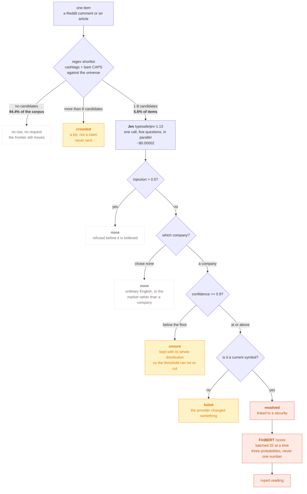
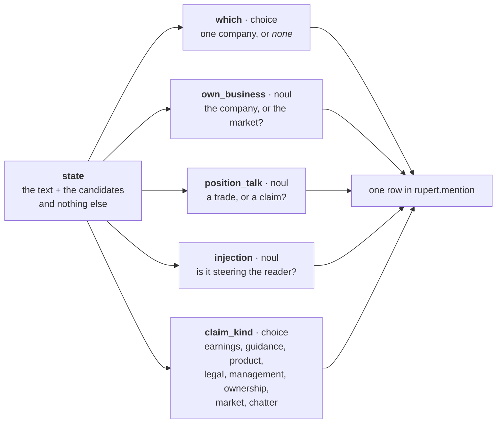
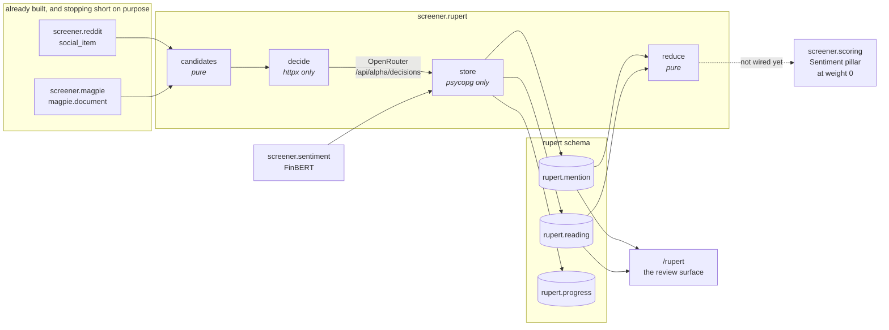
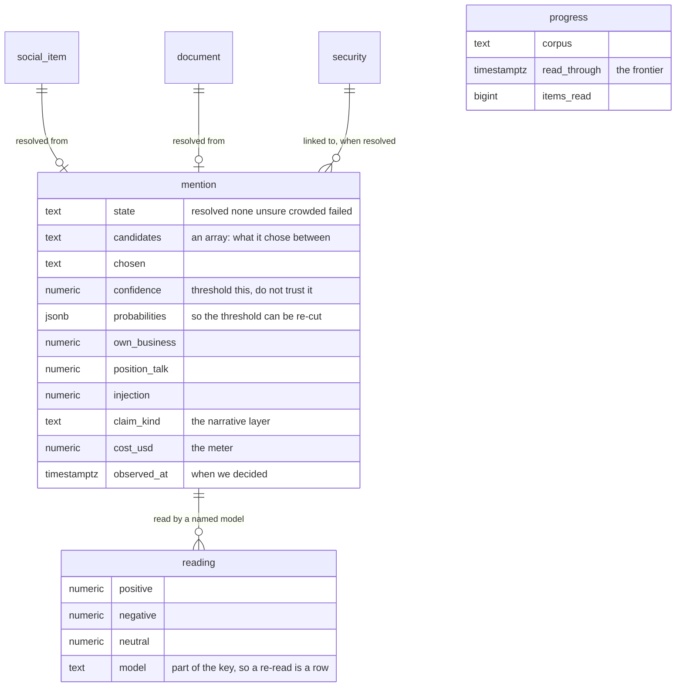
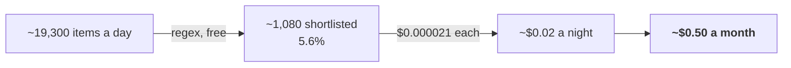

# Rupert — how it works

Which security a text is about, and what kind of thing it says. The join
`screener.reddit` and `screener.magpie` both stopped short of.

**This describes Rupert v1** (since 2026-09-20). The version is the *pipeline* —
the shortlist rules, the question set, the gates and the thresholds — not the
model's build, which `rupert.mention.model` records separately and which moves
independently. Every decision is stamped with it, so two nights taken under
different questions can never be silently compared. The changelog lives in
`src/screener/rupert/version.py`, and `/rupert/how` renders these same diagrams
in the dashboard with the running version on them.

Everything below was measured on the live corpus on 2026-09-20: 424,178 items
over 22 days, against a 1,504-symbol universe.

---

## 1. The decision path

One item goes in. Most of the time nothing comes out, and that is the layer
working rather than failing.

**Why there is no blacklist.** Bare-token matching pulls in ordinary English:
over three days the top 25 matches included `YOU` (113), `ON` (104), `IT` (82),
`ARE` (63), `ALL` (47), `AM` (45), `NOW` (44) and `PM` (43) — beside real
traffic in `MU` (346), `SNDK` (214), `AMD` (157) and `NVDA` (125). Dropping the
first group would discard Allstate, Gartner and ON Semiconductor permanently. A
word list cannot tell *"I put it ALL on calls"* from *"ALL reported a combined
ratio of 91"*, because the difference is the sentence. So the regex shortlists
and something that can read the sentence chooses.

**Why the gates are `noul` and the choice is not.** An independent calibration
test measured this model **overconfident on `choice`** out of distribution
(refit temperature 3.29) and **under-confident on `noul`** (0.66). Erring low is
safe for a gate and dangerous for a link, so the yes/no questions guard and the
choice carries a high floor with its distribution kept.

---

## 2. The five questions, asked in one call

All of them are evaluated in parallel, so asking more costs tokens and not a
round trip.

The state carries the text and the shortlist and **nothing else** — not the
thread, the subreddit, the score or the author. The published guidance is that
accuracy falls as the state fills with content unrelated to the decision, and
the author's karma is not evidence about which company a sentence is about.

`claim_kind` is the narrative layer. It feeds a flag, deliberately not a score.

---

## 3. Where it sits

The dashed edge is the whole remaining question. `reduce` is pure and
**nothing consumes it**: a new input moves a pillar for every ticker on the
night it lands, and the diff step reads a universe-wide shift as a universe-wide
set of crossings. It goes in behind a weight-version bump, not beside one.

---

## 4. The tables

**Two clocks, and they are not the same clock.** A mention carries the item's
own timestamp (when the comment was written) and its `observed_at` (when we
decided). Activity and cost are keyed on `observed_at`; tone and attention on
the item's day. One clock for both would make a backlog being drained look like
a day of feverish posting.

**`rupert.progress` is the frontier, not `max(observed_at)` over the mentions.**
94.4% of the corpus produces no row at all, so an hour in which nobody named a
ticker would be indistinguishable from an hour nobody looked at — the argument
`screener.edgar` makes about `max(filed_date)`, applied to a scalar instead of a
set.

---

## 5. How a night becomes one number

`reduce.mood` turns many readings into one tone per security per night. Two
things happen to them, in this order.

**Trimmed**, a tenth off each end by tone, because one viral post should not
decide a night and the corpus this reads is a subreddit where exactly that is
the risk.

**Then weighted by how much of a view each reading carried**, which is `1 -
neutral`. This is the part that is not obvious, and the measurement is the
argument for it. Across the first 76 real readings:

| | |
|---|---|
| mean `neutral` | **0.727** |
| neutral was the winning label | **63 of 76** |
| genuinely torn (no label above 0.5) | **0 of 76** |

FinBERT is not *unsure* about this corpus. It is **confidently neutral**, which
is a fair description of most retail chatter and a poor input to a mean: a plain
average of `positive - negative` collapses "no view" onto the same zero as
"balanced argument", and since the shrugs are the majority they drag the number
toward a zero that reads as balance when what happened is that nobody said
anything directional.

The claim kind shows where the signal actually is:

| claim kind | n | mean neutral | mean abs tone |
|---|---|---|---|
| `earnings` | 5 | 0.525 | **0.377** |
| `product` | 7 | 0.760 | 0.188 |
| `market` | 42 | 0.742 | 0.184 |
| `chatter` | 19 | 0.768 | 0.170 |

`earnings` reads twice as decisively as `chatter`, and 42 of 76 readings were
price and options talk rather than claims about a business. Weighting lets the
few decisive readings carry the number and the many shrugs count for almost
nothing. Where every reading carries the same view, the weighting is a no-op by
construction, which has its own test.

`certainty` is returned beside `tone` for the reason `mentions` already is: a
tone near zero from forty confident readings and one from forty shrugs are not
the same evidence, and the tone alone cannot say which.

**This is not a version bump.** `VERSION` covers the shortlist rules, the
question set, the gates and the thresholds -- what decides a link. This changes
how readings are aggregated afterwards, no stored decision moves, and nothing
consumes `reduce` yet.

---

## 6. What it costs

Against the project's ~£5–10/month target that is comfortable, but one busy
night still approaches Steven's entire daily allowance for one person — so it
keeps **its own counter**, `RUPERT_DAILY_MAX_CALLS`, on `screener.magpie`'s
precedent. One counter for the assistant and for a corpus pass would let a busy
night on Reddit silence the bot.

It defaults to **0**, which is both the cap and the off switch. This is the only
thing in the tree that spends money per item rather than per question from a
person, so it ships off.

---

## 7. What the corpus can actually support

The number worth knowing before the pillar is wired. Over three days:

| | |
|---|---|
| Securities mentioned at all | **291** |
| With 10 or more mentions | **57** |
| With 30 or more | **27** |
| Active universe | **1,504** |

A Sentiment pillar would be `Absent` for roughly **96% of the universe**. That is
a fact about the corpus rather than a fault, and it is the reason the pillar has
to land at `weight = 0` — `blend` excludes a zero-weighted pillar from both the
blend and `min_coverage`. Whether it belongs as a weighted pillar at all, rather
than as a crowding flag on `event_flag_daily`, is still open.
